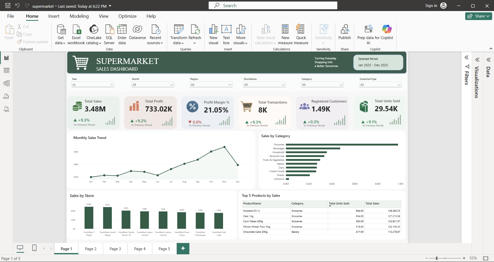
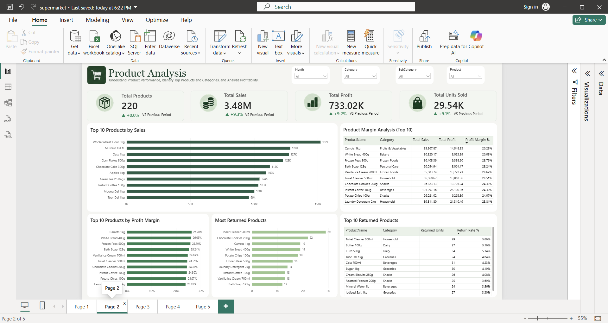
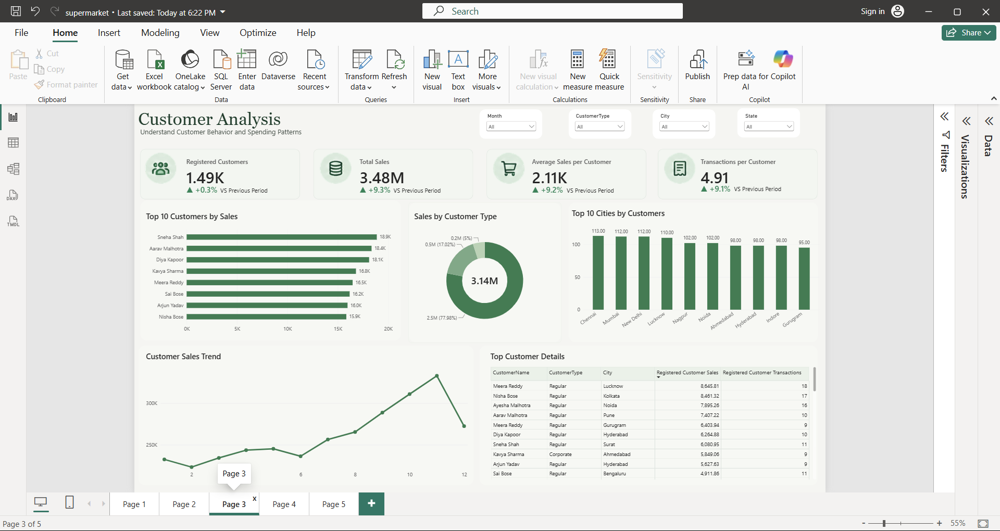
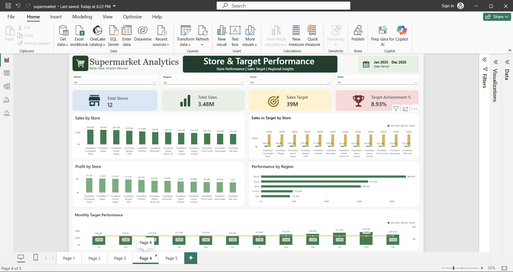
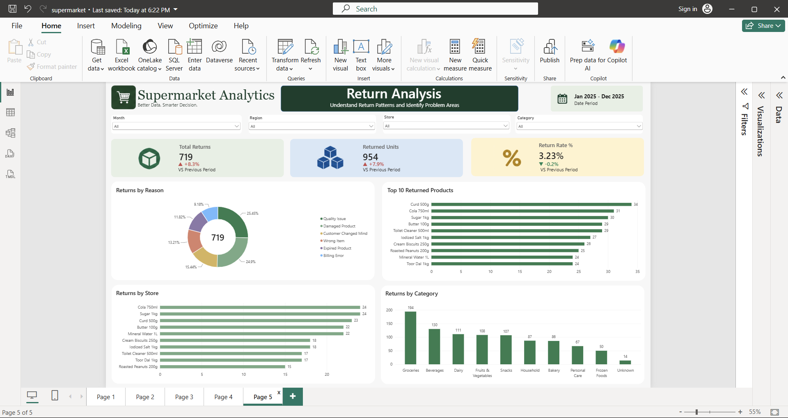

# 🛒 Supermarket Sales & Performance Analytics

An end-to-end Data Analytics project built using **SQL Server, Power BI, and DAX** to analyze supermarket sales, profitability, customers, products, store performance, targets, and returns.

The objective of this project is to transform raw transactional data into meaningful business insights through data cleaning, data modeling, DAX calculations, and interactive dashboards.

---

## 📌 Project Overview

This project simulates a real-world supermarket analytics scenario.

The raw dataset contains sales, customers, products, stores, returns, and target information. The workflow begins with raw CSV files, continues with SQL-based data cleaning and validation, and ends with a 5-page interactive Power BI dashboard.

### End-to-End Workflow

```text
Raw CSV Data
      ↓
SQL Server
      ↓
Data Quality Checks
      ↓
Data Cleaning & Transformation
      ↓
Clean Analytical Tables / Views
      ↓
Power BI Data Model
      ↓
DAX Measures
      ↓
Interactive Dashboard
      ↓
Business Insights
```
## 🛠 Tools & Technologies
SQL Server
SQL Server Management Studio (SSMS)
Power BI
DAX
CSV
GitHub
📊 Dataset

The project uses a realistic synthetic supermarket dataset containing:

20,024 raw sales records
1,500 customers
220 products
12 stores
Returns data
Monthly sales and profit targets
Time period: January 2025 – December 2025
- SQL Server
- SQL Server Management Studio (SSMS)
- Power BI
- DAX
  
| Table     | Purpose                                  |
| --------- | ---------------------------------------- |
| Sales     | Transaction-level sales data             |
| Customers | Customer profile information             |
| Products  | Product, category, pricing and cost data |
| Stores    | Store and regional information           |
| Returns   | Product return transactions              |
| Targets   | Monthly store sales and profit targets   |

🧹 Data Cleaning & Quality Checks

Before building the dashboard, the raw data was validated and cleaned using SQL Server.

The following issues were checked:

Duplicate Sale IDs
Invalid or negative quantities
Invalid or zero unit prices
Invalid discount values
Missing customer information
Unmatched Customer IDs
Unmatched Product IDs
Unmatched Store IDs
Missing customer city/state
Missing product category/subcategory
Invalid return records
Returns linked to nonexistent sales
Raw Sales Rows   : 20,024
Clean Sales Rows : 19,950
Excluded Rows    : 74

🗃 Data Modeling

The Power BI model follows a star-schema style structure.
```text
              Customers
                  │
                  │
Products ───── Sales ───── Stores
                  │
                  │
               Returns

DateTable ───── Sales

Stores ───── Targets
```
The sales_clean table acts as the main fact table.

Dimension tables include:

Customers
Products
Stores
DateTable

📐 Key DAX Measures

Total Sales =
SUMX(
    sales_clean,
    sales_clean[Quantity] *
    sales_clean[UnitPrice] *
    (1 - sales_clean[Discount])
)

Total Cost =
SUMX(
    sales_clean,
    sales_clean[Quantity] *
    RELATED(vw_products_clean[CostPrice])
)

Total Profit =
[Total Sales] - [Total Cost]

Profit Margin % =
DIVIDE(
    [Total Profit],
    [Total Sales]
)

Total Transactions =
DISTINCTCOUNT(
    sales_clean[TransactionID]
)

Total Units Sold =
SUM(
    sales_clean[Quantity]
)

Return Rate % =
DIVIDE(
    [Returned Units],
    [Total Units Sold],
    0
)

## 📈 Dashboard Pages

### 1. Executive Overview

Provides a high-level view of sales, profit, customers, transactions, and overall business performance.



---

### 2. Product Analysis

Analyzes product sales, profitability, categories, product margins, and returned products.



---

### 3. Customer Analysis

Analyzes customer behavior, top customers, customer types, cities, and customer sales trends.



---

### 4. Store & Target Performance

Compares store sales, profit, regional performance, sales targets, and target achievement.



---

### 5. Returns Analysis

Analyzes return reasons, returned units, return rate, top returned products, stores, and categories.



The report contains 5 interactive dashboard pages.


💡 Key Business Insights

Some important analytical observations from the project:

High sales do not always mean high profitability.
Product profitability should be analyzed separately from revenue.
High-value customers can be identified for retention and loyalty strategies.
Store performance can be compared against targets to identify underperforming locations.
Return rate is more meaningful than raw return quantity when comparing products.
Category and regional analysis help identify strong and weak areas of the business

🎯 Business Value

This dashboard can help management:

Monitor overall sales and profitability
Identify top and bottom performing products
Understand customer behavior
Track store-level performance
Compare actual sales against targets
Investigate high-return products
Support data-driven business decisions

🚀 Skills Demonstrated
SQL Data Cleaning
Data Quality Validation
SQL Joins
CTEs
Window Functions
Data Modeling
Star Schema
DAX
Filter Context
Time Intelligence
KPI Design
Data Visualization
Business Analysis
Power BI Dashboard Development

📌 Project Type

Portfolio / Learning Project

The dataset used in this project is synthetic and was created to simulate a realistic supermarket business environment.

👤 Author

Naveen Kumar

Data Analytics / Data Science Learner

